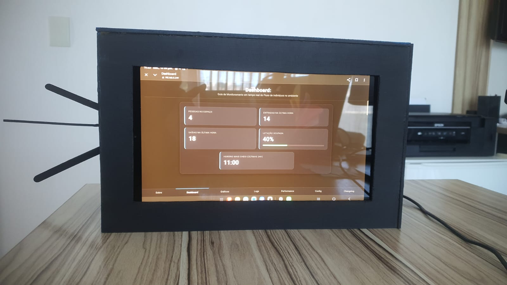
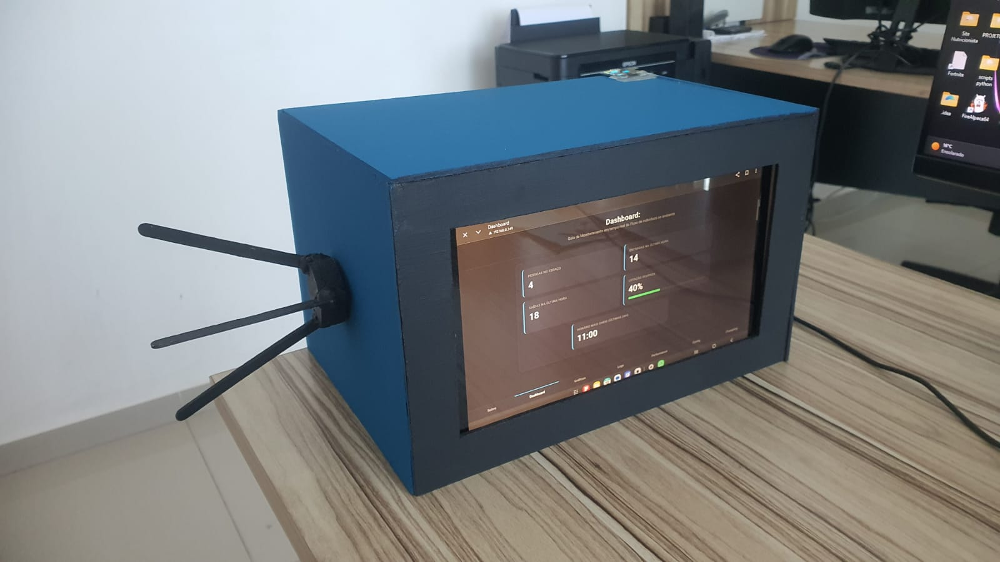
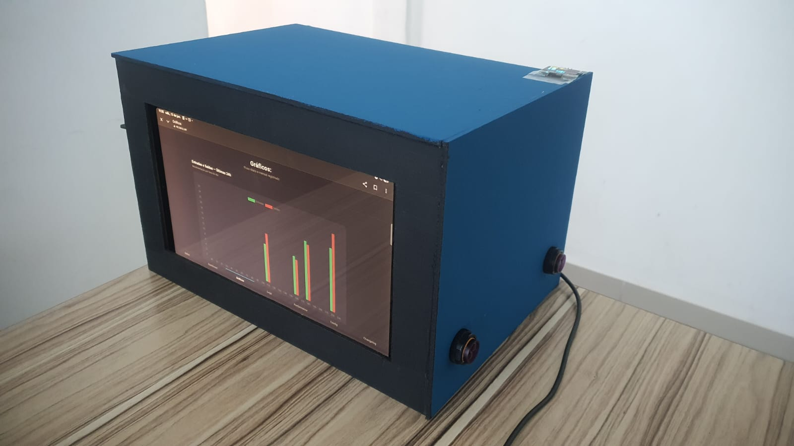
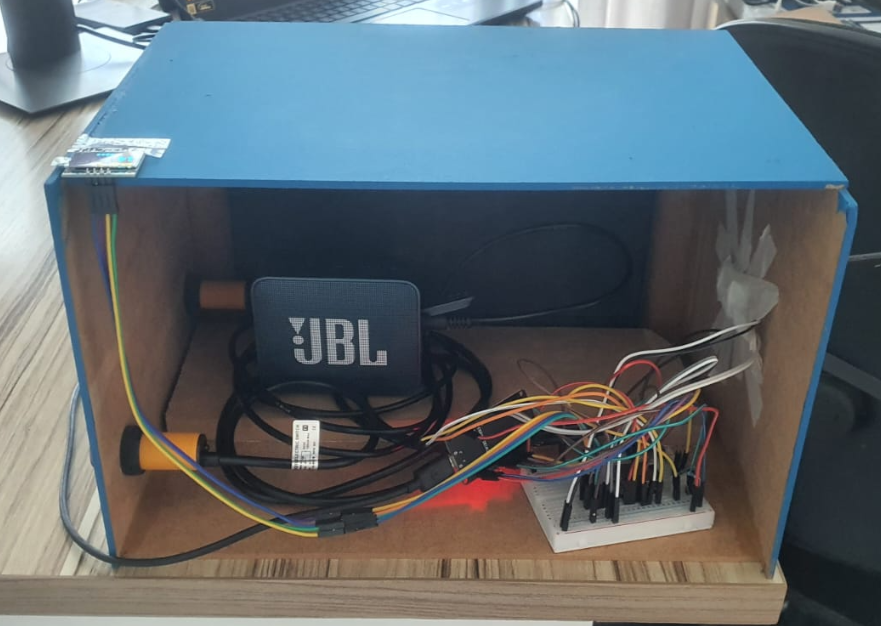

# 📊 Analista de Fluxo

Sistema embarcado desenvolvido com **ESP32** que monitora em tempo real a entrada e saída de pessoas em um ambiente, calcula a lotação ocupada e disponibiliza todas as informações através de um servidor web próprio, acessível por qualquer dispositivo conectado à mesma rede.

O projeto foi desenvolvido para a disciplina de **Performance em Sistemas Ciberfísicos** do curso de **Engenharia de Software** da **PUCPR**, com foco em explorar conceitos de FreeRTOS, multitarefa entre os dois núcleos do ESP32, sincronização com mutexes, persistência local de dados e profiling de desempenho de um sistema embarcado real.

---

## 📸 Demonstração

### Estrutura montada

Protótipo montado, exibindo o dashboard em tempo real com a lotação atual, entradas/saídas da última hora e horário mais cheio.



### Catraca com encoder

Detalhe da catraca com o encoder rotativo KY-040, usado para a contagem redundante de passagens.



### Sensores infravermelhos

Sensores IR E18-D80NK posicionados na lateral da estrutura, responsáveis pela detecção de passagem por par de feixes.



### Parte interna

ESP32, protoboard de conexões e o alto-falante utilizado para os alertas sonoros de lotação.



---

## ✨ Funcionalidades

- 🚶 Contagem de pessoas em tempo real via sensores infravermelhos de passagem (entrada/saída)
- 🎡 Contagem redundante via catraca com encoder rotativo
- 🔊 Alertas sonoros (DFPlayer Mini) ao atingir 50% e 100% da lotação máxima
- 🖥️ Display OLED local com rotação automática de telas (total, entradas, saídas, lotação)
- 🌐 Dashboard web com lotação atual, entradas/saídas na última hora e horário mais cheio das últimas 24h
- 📈 Gráficos históricos de movimentação por hora do dia e por dia (janela de 30 dias)
- 📜 Sistema de logs com níveis (INFO/WARN/ERROR), exportáveis em `.txt` e com expiração automática após 24h
- ⚙️ Página de configuração para ajustar lotação máxima, intervalo de leitura dos sensores, cooldown e credenciais de Wi-Fi, tudo sem regravar o firmware
- 📊 Painel de performance com uso de CPU, heap/PSRAM livres, tempo de execução (profiling) de cada rotina e stack mínimo de cada task do FreeRTOS
- 💾 Persistência total em LittleFS — dados, gráficos e logs sobrevivem a reinicializações e quedas de energia
- 📶 Wi-Fi resiliente: modo AP+STA simultâneo, com ponto de acesso de contingência sempre ativo

---

## 🔄 Como funciona

O projeto divide o processamento em duas tarefas do FreeRTOS, fixadas em núcleos diferentes do ESP32:

**Core 1 — TaskSensores**
Responsável exclusivamente pela leitura dos sensores, em ciclo configurável: leitura dos sensores IR E18-D80NK com uma máquina de estados que identifica a sequência de acionamento (A→B ou B→A) para determinar o sentido da passagem; leitura do encoder KY-040 via interrupção de hardware, contando passos e convertendo-os em uma passagem quando um número mínimo de pulsos é atingido; medição do tempo de execução de cada rotina e cálculo do uso de CPU do núcleo.

**Core 0 — `loop()` principal**
Responsável pela rede e pela interface: servidor web (`WebServer`) que entrega as páginas estáticas (armazenadas em LittleFS) e expõe uma API própria em JSON; sincronização periódica de horário via NTP, com re-tentativa automática enquanto a rede não está disponível; atualização do display OLED; salvamento periódico (a cada 30s) dos dados, gráficos e logs em LittleFS.

Toda alteração no contador de pessoas passa por um mutex (`mutexDados`), e os logs do sistema por outro (`mutexLogs`), garantindo acesso seguro às variáveis compartilhadas entre os dois núcleos.

---

## 🛠️ Tecnologias utilizadas

| Tecnologia | Função |
|---|---|
| C++ (Arduino Framework) | Firmware do ESP32 |
| ESP32 (dual-core) + FreeRTOS | Multitarefa e processamento embarcado |
| HTML5 / CSS3 / JavaScript | Dashboard web |
| WebServer | Servidor HTTP embarcado |
| LittleFS | Persistência de dados, gráficos, logs e páginas web |
| NTPClient | Sincronização de horário |
| Adafruit GFX + Adafruit SSD1306 | Display OLED |
| DFRobotDFPlayerMini | Áudio |

---

## 🔩 Hardware utilizado

| Componente | Função | Pinos |
|---|---|---|
| ESP32 (dual-core) | Microcontrolador principal | — |
| Sensor IR E18-D80NK (x2) | Detecção de passagem (entrada/saída) | GPIO 32 / GPIO 33 |
| Encoder KY-040 | Contagem redundante via catraca | CLK 18 / DT 19 |
| Display OLED SSD1306 | Exibição local dos dados | I2C (SDA 21 / SCL 22) |
| DFPlayer Mini | Alertas sonoros de lotação | RX 26 / TX 27 |

---

## 📂 Estrutura do projeto

```text
Esp32Performance/
│
├── README.md
│
├── imagens/                # Fotos do protótipo montado (usadas neste README)
│
└── meu_projeto/
    ├── meu_projeto.ino     # Firmware: sensores, servidor web, API, persistência
    │
    └── data/               # Páginas servidas via LittleFS
        ├── index.html          # Dashboard
        ├── graficos.html        # Gráficos históricos
        ├── logs.html             # Logs do sistema e histórico de passagens
        ├── performance.html      # Métricas de performance e FreeRTOS
        ├── configuracao.html     # Parâmetros operacionais e Wi-Fi
        ├── changelog.html        # Histórico de versões
        ├── membros.html          # Sobre o projeto e equipe
        ├── style.css
        └── img/                  # Fotos dos membros, usadas na página "Sobre"
```

---

## ⚙️ Como executar

### 1. Abra o projeto na Arduino IDE

Abra o arquivo `meu_projeto.ino` na Arduino IDE com suporte à placa ESP32 instalado.

### 2. Instale as bibliotecas necessárias

Pelo Gerenciador de Bibliotecas da Arduino IDE, instale:

- `NTPClient`
- `DFRobotDFPlayerMini`
- `Adafruit GFX Library`
- `Adafruit SSD1306`

### 3. Configure a rede Wi-Fi

No topo do `meu_projeto.ino`, defina a rede que o ESP32 deve tentar se conectar:

```cpp
char wifi_ssid_dinamico[32] = "SUA_REDE";
char wifi_pass_dinamico[64] = "SUA_SENHA";
```

Não é obrigatório acertar de primeira: o ESP32 sempre sobe também um ponto de acesso próprio (`ESP32_Acesso_Performance`, senha `12345678`), pelo qual dá para acessar a página de configuração e trocar o Wi-Fi sem regravar o firmware.

### 4. Grave o firmware

Compile e faça o upload do `meu_projeto.ino` para a placa.

### 5. Envie os arquivos da pasta `data/`

As páginas do dashboard ficam em LittleFS e precisam ser enviadas separadamente do firmware, com um plugin de upload de LittleFS para a Arduino IDE (ex: `arduino-littlefs-upload`).

### 6. Acesse o dashboard

Pelo Serial Monitor (115200 baud), veja o IP obtido pelo ESP32 na rede, ou conecte-se diretamente ao ponto de acesso `ESP32_Acesso_Performance` e acesse:

```
http://<ip-do-esp32>/
```

---

## 📡 API

| Rota | Método | Descrição |
|---|---|---|
| `/api/status` | GET | Lotação atual, entradas/saídas na última hora, horário mais cheio |
| `/api/historico` | GET | Últimos registros de passagem (buffer circular) |
| `/api/graficos` | GET | Acumulados históricos por hora (24h) e por dia (30 dias) |
| `/api/logs` | GET | Logs do sistema (INFO/WARN/ERROR) |
| `/api/logs/export` | GET | Exporta os logs em `.txt` |
| `/api/performance` | GET | CPU, heap, PSRAM, flash, profiling de funções e stack das tasks |
| `/api/config` | GET / POST | Lê ou altera lotação máxima, intervalo de leitura e cooldown |
| `/api/config_wifi` | POST | Altera SSID/senha da rede Wi-Fi em tempo real |
| `/api/upload_dados` | POST | Restaura um backup de `dados.json` |

---

## ⚠️ Observações

- Os limiares de alerta sonoro (50% e 100% da lotação) usam a DFPlayer Mini e dependem de um cartão SD com os áudios na pasta `01`.
- Enquanto o NTP não sincroniza, o horário exibido é `--:--:--` e as passagens não são contabilizadas nos gráficos, para evitar registros com timestamp inválido.
- O ESP32 mantém o ponto de acesso próprio sempre ativo como contingência, mesmo quando conectado a uma rede Wi-Fi externa.

---

## 🎯 Objetivos do projeto

Este projeto foi desenvolvido para a disciplina de Performance em Sistemas Ciberfísicos, com o objetivo de praticar:

- multitarefa real com FreeRTOS, distribuindo responsabilidades entre os dois núcleos do ESP32;
- sincronização entre tarefas com mutexes, protegendo dados compartilhados;
- profiling de desempenho: medição de tempo de execução, uso de CPU e stack de cada task;
- desenvolvimento de um servidor web embarcado com API própria em JSON;
- persistência de dados em LittleFS, sobrevivendo a reinicializações;
- integração de sensores (IR, encoder), atuadores (OLED, áudio) e rede (Wi-Fi, NTP) em um único sistema ciberfísico.

---

## 📚 Principais aprendizados

Durante o desenvolvimento deste projeto foi possível aprofundar conhecimentos em:

- Programação concorrente com FreeRTOS em um microcontrolador dual-core;
- Tratamento de interrupções de hardware (encoder) e máquinas de estado para debounce de sensores;
- Sincronização de acesso a dados compartilhados entre núcleos com semáforos/mutexes;
- Persistência de dados estruturados (JSON manual) em LittleFS;
- Construção de um servidor web e de uma API REST própria em C++ no ESP32;
- Sincronização de horário via NTP e tratamento de cenários de rede instável;
- Medição e exposição de métricas de performance (CPU, memória, tempo de execução) de um sistema embarcado.

---

## 👥 Equipe

| Nome | Contribuição |
|---|---|
| Bruno Martins Parizotto | Site embarcado (painel, gráficos, logs, configuração e sobre) e estrutura física externa |
| Israel Cristhian de Oliveira | Site embarcado (painel, gráficos, logs, configuração e sobre) |
| João Victor Czech Oliveira | Estrutura principal do firmware (multitarefa) e persistência de dados/logs |
| Mariana Schneider Sobrinho | Gerenciamento de energia, redação técnica (ABNT) e estrutura física externa |
| Rafael Costa Pacheco | Parte física: sensores de passagem, catraca, display e áudio |

Pontifícia Universidade Católica do Paraná (PUCPR) — Engenharia de Software — Performance em Sistemas Ciberfísicos, 2026/1

---

## 📄 Licença

Este projeto foi desenvolvido para fins acadêmicos, como trabalho da disciplina de Performance em Sistemas Ciberfísicos.

---

## 🤖 Uso de inteligência artificial

O uso de inteligência artificial foi realizado para auxiliar no desenvolvimento do projeto, apoiando a revisão de código do firmware, a depuração de problemas de hardware e a organização da interface web. Os códigos produzidos foram revisados e analisados pelos desenvolvedores, na busca de validar sua qualidade. Os principais recursos de apoio utilizados foram: Claude (Anthropic), Gemini (Google), Arduino IDE, GitHub e tutoriais em vídeo no YouTube.
